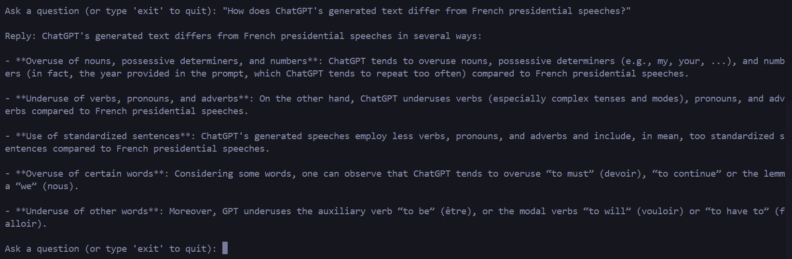

# LLM Task
 
# Gemini PDF Question Answering System

### This CLI app let's users upload, process it, and ask questions on the content using a conversational chat powered by Google's Gemini-pro.

## Prerequisites
* Python 3.10 or higher
* PyPDF2
* Langchain
* Google Generative AI
* Google Cloud SDK

## Installation
1. Clone this repository to your local machine.
2. Create a virtual environment and activate it.
3. Install the required packages by running ```pip install langchain google-generativeai faiss-cpu python-dotenv PyPDF2 langchain_google_genai```
4. Create a ```.env```file in the root directory of the project and add your Google API key:

```python
GOOGLE_API_KEY=your_google_api_key
```
5. Run the application by executing ```python new_app [file_name]```
   - change the file_name with the pdf name that you want to work on.
6. After processing the PDF, the application will enter an interactive mode where you can ask questions. 
   - the answers will come in command line like this
   
   - there will be on-screen commands
   - if the question does not have any answer from the provided pdf then the response will be blank.
   - type 'exit' to quit the program

## Code Structure of the main file
### 1. `get_pdf_text`: Extract Text from PDF Files
- **Purpose**: This function extracts text from the uploaded PDF files.
- **How It Works**: It takes a list of PDF file paths, reads each file using `PyPDF2`, and concatenates all the text from each page. The resulting string contains the complete content from all PDFs combined.

### 2. `get_text_chunks`: Split Extracted Text into Chunks
- **Purpose**: This function splits the extracted text into smaller, manageable chunks.
- **How It Works**: Using the `RecursiveCharacterTextSplitter` from Langchain, the function divides the text into chunks of 10,000 characters each, with a 1,000-character overlap between consecutive chunks. This ensures that context is preserved across chunks for better question answering.

### 3. `get_vector_store`: Create a Vector Database for Text Chunks
- **Purpose**: This function creates a vector database for the text chunks.
- **How It Works**: It uses the embeddings from Google Generative AI to transform each text chunk into a vector representation. These vectors are then stored using FAISS, which is a library for efficient similarity search. The vector database is saved locally as `"faisss_index"`.

### 4. `get_conversational_chain`: Create a Conversational Chain
- **Purpose**: This function creates a conversational chain to be used for answering questions.
- **How It Works**: It defines a prompt template for how to respond to user queries. It uses the `ChatGoogleGenerativeAI` model (`gemini-pro`) and creates a question-answering chain (`load_qa_chain`) that combines context and user input to generate a detailed response.

### 5. `process_user_input`: Handle User Input and Generate Answers
- **Purpose**: This function processes user input, searches the vector store, and generates a response.
- **How It Works**: When the user provides a question, this function retrieves relevant chunks from the FAISS vector store by performing a similarity search. It then uses the conversational chain to generate an answer based on the user question and the most relevant parts of the extracted PDF text.

### 6. `main`: Set Up the Command-Line Application and Run the User Interaction Loop
- **Purpose**: This is the main function that sets up the CLI program and runs the user input process.
- **How It Works**: It uses `argparse` to parse command-line arguments (the list of PDF file paths). After extracting text, splitting it into chunks, and storing the vectors, it enters a loop where the user can ask questions about the content of the processed PDF files. The loop will continue until the user types `'exit'`.
